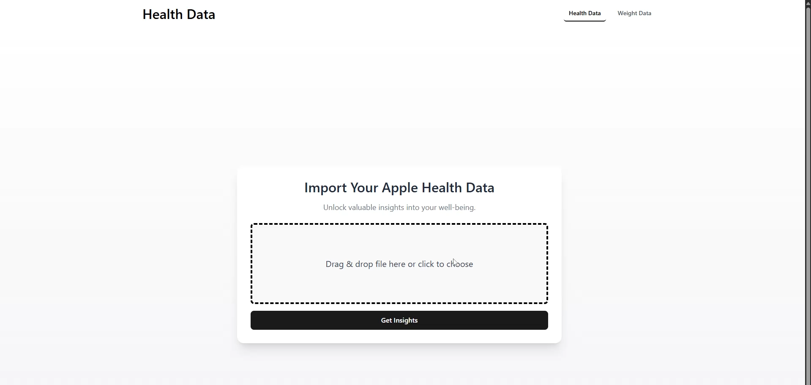
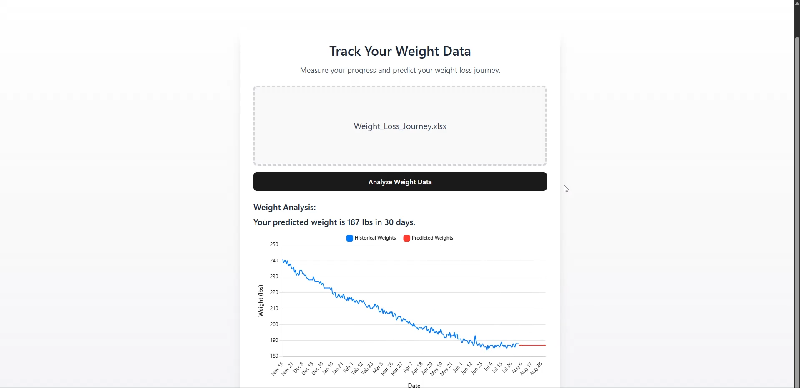

# 🦆 Quack-Hacks Health Tracker  

## 🚀 Team Information  
**Team Name:** Quack-Hacks Health Tracker  
**Team Members:** Haig Emirzian, Nick Weidman, Brian Sampson, Joy Khera  

## 🩺 Overview  
The human body is a complex system, constantly working behind the scenes. Our **Health Tracker** brings order to this complexity by providing **insights into your well-being** and **predicting future weight trends** based on your lifestyle.  

Our platform is designed around two core features:  
🔹 **Health Data** – Understand your daily activity and vital metrics.  
🔹 **Weight Data** – Predict your future weight trajectory based on your current habits.  

## 🔍 Features  

### 🏃 Health Data  
✔️ Gain insights into **active energy burned, heart rate, step count**, and more.  
✔️ Identify trends in your daily **health metrics**.  
✔️ Receive **custom-tailored recommendations** for a healthier lifestyle.  

### ⚖️ Weight Data  
✔️ Upload your **weight fluctuations** and receive a **30-day weight prediction**.  
✔️ Visualize your **progress and future trends** to stay motivated.  
✔️ Uses a **Recurrent Neural Network (RNN) with a Long Short-Term Memory (LSTM) architecture**, leveraging a **30-day sliding window approach** to detect patterns and predict future weight trends.  
✔️ Get a clearer picture of **how long you need to stick to your plan**.  

## 🛠️ Tech Stack  
| **Category**       | **Technologies**  |  
|--------------------|-----------------|  
| **Backend**       | Flask, PyTorch   |  
| **Frontend**      | React, Tailwind, Express |  
| **Data Processing** | Databricks      |  
| **Machine Learning** | RNN with LSTM (30-day sliding window) |  
| **Languages**     | Python, JavaScript |  

## 🎯 Our Goal  
Empower users with **data-driven insights** to make informed health decisions—**even before they know they need to.**  

## Gallery

